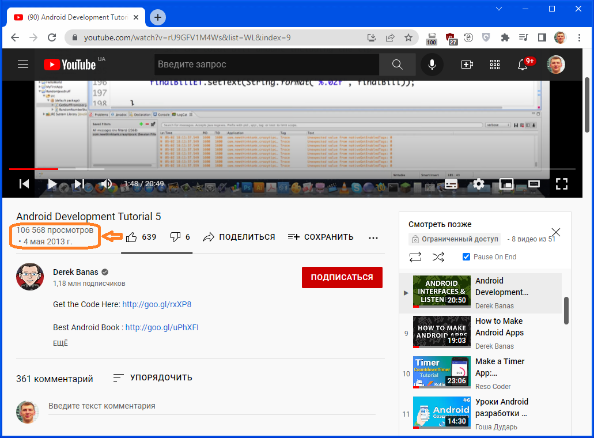

# ShowDateOnYoutube
ShowDateOnYoutube Chrome Extension for YouTube

Extension created to fix issue: Youtube hides the video publication date if it doesn't have enough space on the page. This code allows you to show the video publication date (if it is hidden) under the number of views

